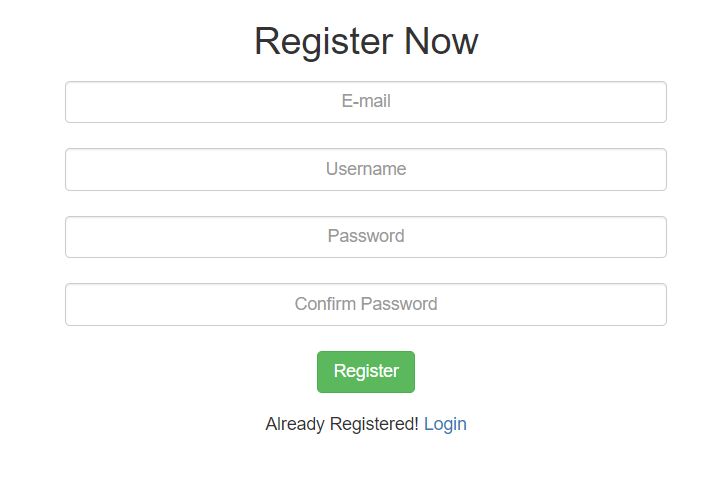

<h1>
    Employability Consultancy System using MongoDB,Express,react(javascript) and Node.js   
</h1>

## What is Employability Consultancy?
This Employability Consultancy System provide guidance to people making choices about their career. They could help a client who wants to further their career, a client who wants to change career direction, or a client who isn't quite sure what they want.


## Getting Started
 
 ## What is this project for ?
This is a Simple User(client side) application system done with react(javascript) Node.js(that connects the client and server) Framework along with MongoDB which is a database management system. Here we also used Express framework, Express-session  handle used  to track the user's session.


## Deployment
This project is deployed in Heruko which is a conyainer based cloud platform as a service

## Components implemented

### •Registration Form:
This is an applicated where the user gets to register their account by filling their Email, Username, Password.
These cedentials are verfified and are stored in the  mongodb (atlas) database



### •Login Form:
In the login form application the user can be able to login to the site by entering his/her credentials like email,Password. After the verification of user's current credentials with the ones in database the suer is allowed to the home page. If the credentials are incorrect the user stays in the same page.


### •Password Reset:
If the user forgets his/her password, they can reset their passwrod by clicking the forgot passwrod link.
There the user will be asked to enter the email and new passwrod .
Here also if the email is present in the database then only the user is authorized to change the password


### DataBase:
Here we have used **[MongoDB Atlas(Cloud)](https://www.mongodb.com/cloud/atlas)** as the database.
Here we have a collection named 
-user 
Which can stored the user's credentials 

## Prerequisites
Tools that we need to run this app:

- ***[Node.js](https://nodejs.org/en/)***
- ***[Node Package Manager(npm)](https://www.npmjs.com/get-npm)***
- ***[MongoDB (Atlas)](https://www.mongodb.com/cloud/atlas)***

## Connection to DataBase
In server.js file on line where it is mentioned as const uri  change ***```<DATABASE_USERNAME>```*** with your DataBase connection link of mongodb atlas &  reset the passwrod ***```<DATABASE_PASSWORD>```*** with your DataBase Password that you have set.


## To Run the App

node server.js

The server will start Running on
+ http://localhost:3000/
which is compiled as 
+ http://127.0.0.1:3000/


## Ownership

Chelimala Anjani Reddy
Gottipati Divya

Github profile link:
https://github.com/anjanir-26/MSWD_SDP-2